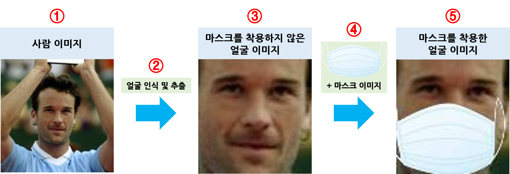
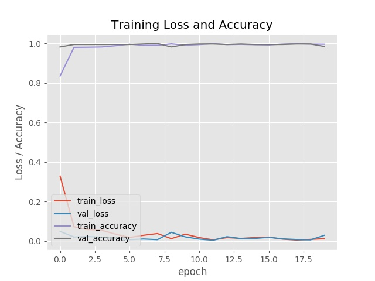
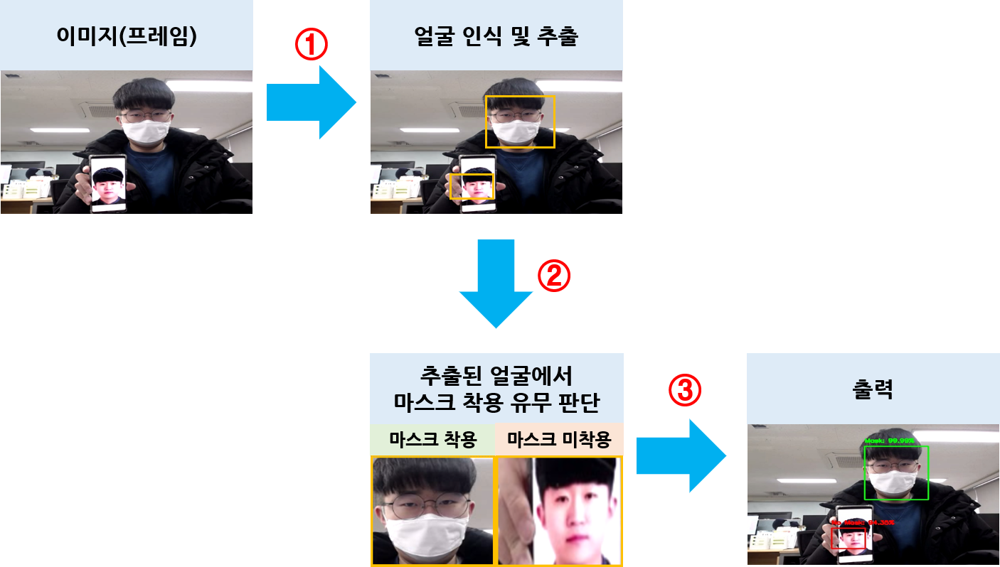
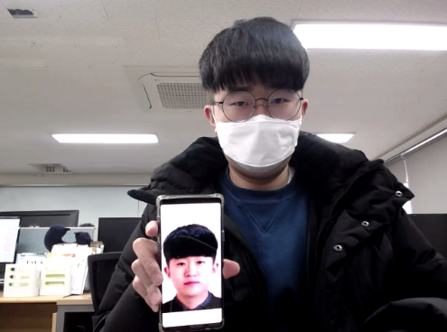
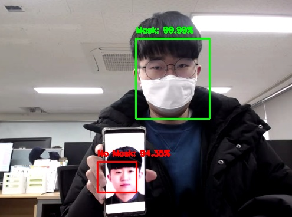

  

     
  

---
### 실행 환경
* #### Ubuntu
* #### tensorflow-gpu Version : 2.0.0
  * ##### 설치 : https://blog.naver.com/dldudcks1779/222013424776
* #### keras(tensorflow에 내장) Version : 2.2.4-tf
* #### OpenCV Version : 3.x.x
  * ##### 설치 : https://blog.naver.com/dldudcks1779/222020005648
* #### imutils
  * ##### 설치 : sudo pip3 install imutils
* #### face_recognition
  * ##### 설치 : sudo pip3 install face_recognition
* #### sklearn
  * ##### 설치 : sudo pip3 install sklearn
* #### matplotlib
  * ##### 설치 : sudo pip3 install matplotlib

---
## 마스크 착용 유무 판단 시스템
* ### 학습 dataset 생성
  
  

    

       
    

  

  
  * #### ① 사람 이미지(with_mask_create/face_images) : 1000개의 사람 이미지 파일
  * #### ② 얼굴 인식 및 추출(with_mask_create/face_detector.py) : 사람 이미지 파일에서 얼굴 인식 및 추출 후 저장
    * ##### 실행 : sudo python3 face_detector.py
    * ##### 참고(face_recognition을 이용한 Face Detection(얼굴 인식)) : https://blog.naver.com/dldudcks1779/222161831473
  * #### ③ 마스크를 착용하지 않은 얼굴 이미지(dataset/without_mask) : 추출한 1000개의 마스크를 착용하지 않은 얼굴 이미지 파일
  * #### ④ 마스크를 착용한 이미지 생성(with_mask_create/with_mask_create.py + with_mask_create/face_masker.py) : 추출한 얼굴 이미지 파일에 마스크 이미지(mask_images)를 추가하여 마스크(흰색, 검은색, 파란색)를 착용한 이미지 생성
    * ##### 실행 : sudo python3 with_mask_create.py
    * ##### 참고(face_recognition을 이용한 Face Landmarks Detection(얼굴 랜드마크 인식)) : https://blog.naver.com/dldudcks1779/222162938060
  * #### ⑤ 마스크를 착용한 얼굴 이미지(dataset/with_mask) : 마스크 이미지를 추가한 1000개의 마스크를 착용한 얼굴 이미지 파일(흰색 마스크 착용 600개, 검은색 마스크 착용 300개, 파란색 마스크 착용 100개)

* ### 마스크 착용 유무 판단 모델 학습(train_mask_detector.py)
  * #### MobileNetV2
    * #### 모바일이나, 임베디드에서도 실시간 작동할 수 있게 모델이 경량화(메모리와 연산량 감소)
    * #### 정확도 또한 많이 떨어지지 않아 속도와 정확도 사이의 트레이드-오프(trade-off) 문제를 어느정도 해결
    * #### 트레이드-오프(trade-off) 문제 : 한 부분의 성능을 높이면 다른 부분의 성능이 낮아지는 문제
  * #### Nadam(Nesterov-accelerated Adaptive Moment Estimation) : NAG(Nesterov Accelarated Gradient) + Adam(Adaptive Moment Estimation)
    * #### NAG(Nesterov accelarated gradient)
      * ##### momentum 이 이동시킬 방향으로 미리 이동해서 gradient 를 계산(불필요한 이동을 줄이는 효과) - 정확도 개선
      * ##### momentum : 경사 하강법에 관성을 더해주는 것으로, 매번 계산되어진 기울기에 과거 이동했던 방향을 기억하면서 그 방향으로 일정 값을 추가적으로 더해주는 방식
    * #### Adam(Adaptive Moment Estimation) : momentum + RMSProp (정확도와 보폭 크기 개선)
      * ##### RMSProp : Adagrad 의 보폭 민감도를 보완한 방법(보폭 크기 개선)
      * ##### Adagrad : 변수의 업데이트가 잦으면 학습률을 적게하여 이동 보폭을 조절하는 방법(보폭 크기 개선)
  * #### 실행 : sudo python3 train_mask_detector.py
  * #### 학습 결과
    

      

         
      

    

    
    * ##### mask_detector.h5 : 마스크 착용 유무 판단 모델 가중치

* ### 마스크 착용 유무 판단 과정
  
  

    

       
    

  

  * #### ① 이미지(프레임)에서 얼굴 인식 및 추출
    * ##### 참고(DNN(Deep Neural Network)를 이용한 Face Detection(얼굴 인식)) : https://blog.naver.com/dldudcks1779/222180883779
  * #### ② 학습한 Mask Detector 모델을 이용하여 추출된 얼굴에서 마스크 착용 유무 판단
  * #### ③ 마스크 착용 유무 판단 결과 출력
    * ##### 마스크 착용 확률 70% 이상 초록색 50% 이상 70% 미만 노란색
    * ##### 마스크 미착용 확률 70% 이상 빨간색 50% 이상 70% 미만 노란색

---
## 마스크 착용 유무 판단 시스템 - 이미지
* #### 이미지를 저장하지 않을 경우
  * sudo python3 mask_detector_image.py --input 이미지 경로
    * 예) sudo python3 mask_detector_image.py --input ./test_image.jpg
* #### 이미지를 저장할 경우
  * sudo python3 mask_detector_image.py --input 이미지 경로 --output 저장할 이미지 경로
    * 예) sudo python3 mask_detector_image.py --input ./test_image.jpg --output ./result_image.jpg

  

     
    
  

---
## 마스크 착용 유무 판단 시스템 - 웹캠 또는 동영상(webcam or video)
* #### 비디오를 저장하지 않을 경우
  * webcam : sudo python3 mask_detector_video.py
    * 예) sudo python3 mask_detector_video.py
  * video : sudo python3 mask_detector_video.py --input 비디오 경로
    * 예) sudo python3 mask_detector_video.py --input ./test_video.avi
* #### 비디오를 저장할 경우
  * webcam : sudo python3 mask_detector_video.py --output 저장할 비디오 경로
    * 예) sudo python3 mask_detector_video.py --output ./result_video.avi
  * video : sudo python3 mask_detector_video.py --input 비디오 경로 --output 저장할 비디오 경로
    * 예) sudo python3 mask_detector_video.py --input ./test_video.avi --output ./result_video.avi

---
